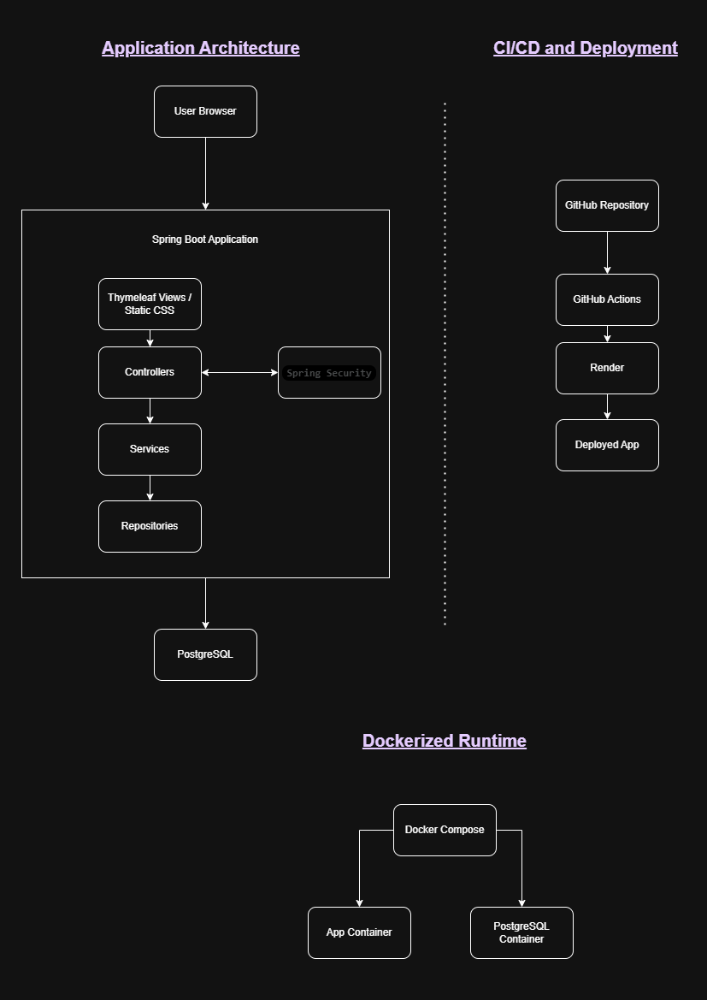
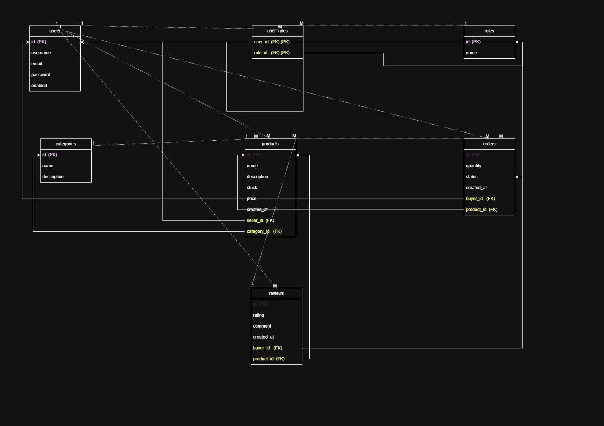

# Mini Marketplace

## Project Overview

Mini Marketplace is a full stack web application developed for the Software Engineering Lab project. The system demonstrates a complete professional workflow using Spring Boot, Thymeleaf, PostgreSQL, Spring Security, Docker, GitHub Actions, and deployment on Render.

The project focuses on core software engineering practices rather than feature volume. It provides role-based access control for `ADMIN`, `SELLER`, and `BUYER`, a layered architecture, automated testing, containerized deployment, and CI/CD support.

## Objective

The objective of this project is to build a small but complete production-style application that demonstrates:

- layered backend architecture
- secure authentication and authorization
- database design with relational mappings
- unit and integration testing
- Docker-based local setup
- GitHub-based collaboration workflow
- CI/CD and cloud deployment readiness

## Project Theme

This repository implements the `Mini Marketplace` theme from the lab requirements.

## Core Features

- User registration and login with encrypted passwords
- Role-based authorization using Spring Security
- Public product browsing and product detail pages
- Seller product management
- Buyer order placement and order tracking
- Buyer product reviews
- Admin user management
- Admin category management
- Admin order oversight
- Global exception handling and custom error pages

## Technology Stack

| Layer | Technology |
| --- | --- |
| Backend | Spring Boot 3, Spring MVC, Spring Data JPA |
| Frontend | Thymeleaf, HTML, CSS |
| Security | Spring Security, BCrypt |
| Database | PostgreSQL, H2 for tests |
| Build Tool | Maven |
| Testing | JUnit 5, Mockito, Spring Boot Test, MockMvc |
| Containerization | Docker, Docker Compose |
| CI/CD | GitHub Actions |
| Deployment | Render |

## System Roles

### Admin

- Manage users
- Change user roles
- Delete non-protected users
- Manage categories
- View all orders
- Access the admin dashboard

### Seller

- Create products
- View own products
- Edit own products
- Delete own products

### Buyer

- Register and log in
- Browse products
- Place orders
- View personal order history
- Mark orders as received
- Cancel own orders
- Submit one review per product

## Architecture

The application follows a layered Spring Boot architecture:

1. `Controller` layer handles HTTP requests and Thymeleaf page rendering.
2. `Service` layer contains business rules and authorization checks.
3. `Repository` layer manages database access through Spring Data JPA.
4. `Model` layer defines the JPA entities and relationships.
5. `DTO` layer is used for validated form input and request data transfer.
6. `Security` layer controls authentication, login flow, and role-based access.

### Main Packages

- `src/main/java/com/marketplace/mini_marketplace/controller`
- `src/main/java/com/marketplace/mini_marketplace/service`
- `src/main/java/com/marketplace/mini_marketplace/repository`
- `src/main/java/com/marketplace/mini_marketplace/model`
- `src/main/java/com/marketplace/mini_marketplace/dto`
- `src/main/java/com/marketplace/mini_marketplace/security`
- `src/main/resources/templates`

## Database Design

The current database design includes these main entities:

- `User`
- `Role`
- `Category`
- `Product`
- `Order`
- `Review`

### Entity Relationships

- One `User` can have many `Product` records as a seller.
- One `User` can have many `Order` records as a buyer.
- One `User` can have many `Review` records as a buyer.
- One `Category` can contain many `Product` records.
- One `Product` belongs to one `Category`.
- One `Product` can have many `Order` records.
- One `Product` can have many `Review` records.
- `User` and `Role` have a many-to-many relationship through `user_roles`.

## Security Design

The application uses Spring Security with:

- custom login page
- registration flow
- BCrypt password hashing
- role-based URL and method protection
- protected actions for sellers, buyers, and admins

Public access is allowed for login, registration, static assets, product browsing, and category browsing. Protected actions are enforced using both security configuration and method-level authorization with `@PreAuthorize`.

## Application Endpoints

The project is implemented as a server-rendered web application. The main HTTP endpoints are listed below.

### Public Endpoints

| Method | Endpoint | Description |
| --- | --- | --- |
| GET | `/` | Redirect to products page |
| GET | `/index` | Index page |
| GET | `/auth/login` | Login page |
| GET | `/auth/register` | Registration page |
| POST | `/auth/register` | Register new user |
| GET | `/products` | View all products |
| GET | `/products/{id}` | View product details |
| GET | `/categories` | View all categories |
| GET | `/products/{id}/reviews` | View reviews for a product |

### Seller Endpoints

| Method | Endpoint | Description |
| --- | --- | --- |
| GET | `/products/new` | Product creation form |
| POST | `/products` | Create product |
| GET | `/products/my` | View seller products |
| GET | `/products/{id}/edit` | Edit product form |
| POST | `/products/{id}/update` | Update product |
| POST | `/products/{id}/delete` | Delete product |

### Buyer Endpoints

| Method | Endpoint | Description |
| --- | --- | --- |
| POST | `/orders` | Place order |
| GET | `/orders/my` | View personal orders |
| POST | `/orders/{id}/cancel` | Cancel order |
| POST | `/orders/{id}/receive` | Mark order as received |
| POST | `/products/{id}/reviews` | Submit review |

### Admin Endpoints

| Method | Endpoint | Description |
| --- | --- | --- |
| GET | `/orders/all` | View all orders |
| GET | `/admin/dashboard` | Admin dashboard |
| GET | `/admin/users` | Manage users |
| POST | `/admin/users/{id}/role` | Change user role |
| POST | `/admin/users/{id}/delete` | Delete user |
| POST | `/categories` | Create category |
| GET | `/categories/{id}/edit` | Edit category form |
| POST | `/categories/{id}/update` | Update category |
| POST | `/categories/{id}/delete` | Delete category |

## Exception Handling

Global exception handling is implemented with `@ControllerAdvice`.

Handled scenarios include:

- `404 Not Found` for missing resources
- `403 Forbidden` for unauthorized access
- `500 Internal Server Error` for unexpected failures

Custom error views are provided under `src/main/resources/templates/error`.

## DTO Usage

DTOs are used to separate form input and validation logic from persistence models:

- `UserDTO`
- `ProductDTO`
- `OrderDTO`
- `ReviewDTO`
- `CategoryDTO`

This helps keep the controller and entity layers cleaner and supports input validation using Jakarta Validation annotations.

## Testing

The repository includes both service-layer unit tests and controller-layer integration tests.

### Unit Tests

Service tests are included for:

- `UserService`
- `ProductService`
- `OrderService`
- `ReviewService`
- `CategoryService`

### Integration Tests

Controller tests are included for:

- `AuthController`
- `ProductController`
- `OrderController`

### Test Tools

- JUnit 5
- Mockito
- Spring Boot Test
- MockMvc
- H2 in-memory database for test profile

To run tests:

```bash
mvn clean test
```

## Local Development Setup

### Prerequisites

- Java 17
- Maven
- PostgreSQL
- Docker Desktop, if running with containers

### Option 1: Run Locally Without Docker

1. Create a PostgreSQL database.
2. Update the development datasource configuration if needed.
3. Run the application:

```bash
mvn spring-boot:run
```

The application starts on `http://localhost:8080`.

### Option 2: Run With Docker Compose

1. Create a `.env` file based on `.env.example`.
2. Start the application and database:

```bash
docker compose up --build
```

The application will be available at `http://localhost:8080`.

## Environment Configuration

Typical environment variables used by the project include:

- `DB_NAME`
- `DB_USER`
- `DB_PASSWORD`
- `SPRING_DATASOURCE_URL`
- `SPRING_DATASOURCE_USERNAME`
- `SPRING_DATASOURCE_PASSWORD`

These values are used for Dockerized and production deployments. Sensitive values should be stored in environment variables or Render service settings, not in source control.

## Dockerization

The repository includes:

- `Dockerfile` for building the Spring Boot application image
- `docker-compose.yml` for running both the application and PostgreSQL

The Docker setup supports:

- application container
- database container
- environment-based configuration
- reproducible local execution

## CI/CD

The repository already contains a GitHub Actions workflow in `.github/workflows/deploy.yml`.

### Current Workflow

- triggers on pushes to `main`
- triggers on pull requests targeting `main`
- sets up JDK 17
- runs the Maven test suite
- uploads test reports as workflow artifacts

### Recommended Final Pipeline for Submission

For full lab compliance, the final CI/CD setup should include:

1. Pull request validation on feature and develop branches
2. Automated test execution before merging into `main`
3. Automatic deployment to Render after a successful merge into `main`

If Render auto-deploy is enabled from the `main` branch, deployment can be triggered automatically after the GitHub workflow passes.

## Git Workflow

The recommended branch strategy for this project is:

- `main` for production-ready code
- `develop` for team integration
- `feature/<feature-name>` for individual tasks

Required collaboration rules:

- no direct push to `main`
- all changes go through pull requests
- at least one review approval before merging

## Deployment

The application is intended to be deployed on Render as a public web service.

### Submission Fields

- GitHub repository: `https://github.com/soruprohan/mini-marketplace`
- Live deployment URL: `https://mini-marketplace-yrlp.onrender.com`

## Default Seed Data

The application seeds core roles and a default admin account through `src\main\java\com\marketplace\mini_marketplace\config\DataSeeder.java`.

### Seeded Roles

- `ROLE_ADMIN`
- `ROLE_SELLER`
- `ROLE_BUYER`

### Default Admin Account

- Username: `admin`
- Email: `admin@marketplace.com`
- Password: `password123`

This account is intended for initial system administration and should be changed or secured appropriately in a production environment.

## System Diagrams

### System Architecture Diagram

The following diagram presents the overall system architecture, including the Spring Boot application layers, PostgreSQL database, Dockerized runtime, and CI/CD deployment flow.



### Entity Relationship Diagram

The following ER diagram represents the database structure used by the application, including users, roles, products, orders, reviews, categories, and the `user_roles` join table.



### Diagram Source Files

The diagram images are stored in:

- `diagram/systemArchitectureDiagram.png`
- `diagram/erDiagram.png`


## Deliverables Checklist

- GitHub repository
- Professional README
- Architecture diagram
- ER diagram
- API or endpoint documentation
- Dockerized setup
- Unit and integration tests
- GitHub Actions workflow
- Render deployment


## Project Structure

```text
mini-marketplace/
├── .github/workflows/
├── src/main/java/com/marketplace/mini_marketplace/
│   ├── controller/
│   ├── dto/
│   ├── exception/
│   ├── model/
│   ├── repository/
│   ├── security/
│   └── service/
├── src/main/resources/
│   ├── templates/
│   ├── static/css/
│   ├── application.yaml
│   ├── application-dev.yml
│   ├── application-prod.yml
│   └── data.sql
├── src/test/
├── Dockerfile
├── docker-compose.yml
├── pom.xml
└── README.md
```

## Notes

- This project is designed for academic demonstration of full stack development and DevOps workflow.
